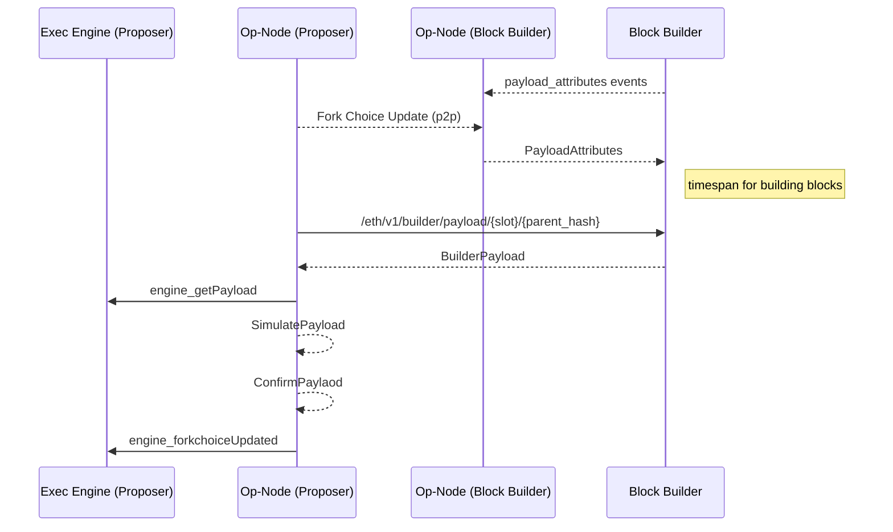

# Op-Geth Builder

This is an implementation of a block builder for proposer / builder separation (PBS) in the optimism stack. Please see [this guide](https://github.com/flashbots/optimism/blob/daa43f158ffca0bfaba18391f688fed1d8a8f3d9/pbs/README.md) on how to run and test with a local devnet.

## Block Builder API Interation

The builder requires an [op-node](https://github.com/flashbots/optimism/tree/pbs) that publishes an event stream with the block payload attributes to trigger block building. 

To request a block, the proposer does a http request to the builder in parallel with its local node for a block as a failsafe. The following sequence diagram describes the interactions between the builder and the proposer.

## Components

There are two main components of the builder.

* `miner` module responsible for block building logic. Receives payload attributes as block building parameters and build blocks from its transaction pool.

* `builder` module for handling communication with the proposer and its op-node. Triggers a continuous block building job in the `miner` module on receiving the payload attributes from its op-node.

## Usage

To enable the builder:

  * `--builder` Enable the Builder module
  * `--builder.beacon_endpoints` list of op-node SSE event stream endpoints to subscribe from

Run `geth --help` for the full list of builder configurations.